# Mahdey Hussain - Personal Portfolio

A four-page personal portfolio website built with HTML5 and CSS3 for INFR3120 (Web and Scripting Programming), Assignment 1.

## Links

- **Live site:** https://mahdeyhussain.github.io/Mahdey-Portfolio/
- **GitHub repository:** https://github.com/mahdeyhussain/Mahdey-Portfolio

## Pages

- **Home (`index.html`)** - welcome message and an overview of the site.
- **About Me (`about.html`)** - my photo with a caption, a short introduction, and an introduction video embedded with HTML5 `<video>` (with `controls` and a `poster` image).
- **Projects (`projects.html`)** - four projects from school and personal work, each in its own `<section>` with a heading and description.
- **Contact Me (`contact.html`)** - a contact form (name, email, cell number, message, and a "2 + 2" robot check) that sends to my email using `mailto`, with HTML5 validation on every field.

Every page shares the same header with navigation and the same footer with my contact email and copyright.

## File Structure

```
portfolio/
├── .vscode/          (VS Code settings - spell checker dictionary)
├── index.html
├── about.html
├── projects.html
├── contact.html
├── README.md
├── css/
│   ├── full.css
│   ├── tablet.css
│   └── smartphone.css
├── images/
│   ├── mahdey.jpg
│   ├── poster.png
│   └── colour-scheme.png
├── videos/
│   └── intro.mp4
└── screenshots/      (validation, testing and responsive view screenshots)
```

## Semantic HTML

Each page uses HTML5 semantic tags instead of plain divs:

- `<header>` - site title and navigation
- `<nav>` - links to all four pages
- `<article>` - the main content of each page
- `<section>` - subtopics inside the article (e.g. each project, the video, the form)
- `<figure>` and `<figcaption>` - my photo and its caption
- `<address>` - contact email in the footer
- `<footer>` - email and copyright

## Responsive Design: Viewport Sizes

The site uses **fluid design** and **media queries** with a separate style sheet for each viewport. The three style sheets are linked in the `<head>` of every page using the `media` attribute, and the `<meta name="viewport" content="width=device-width">` tag makes mobile devices report their real screen width.

| Style sheet | Viewport width | Why |
|---|---|---|
| `full.css` | 960px and wider (laptop/desktop) | 960px is the standard grid width from the Week 1 lecture that fits all laptop and desktop screens. Content sits in a fixed 960px centred wrapper, and the project boxes float two per row. |
| `tablet.css` | 481px to 959px (tablet) | Uses fluid percentage widths so content scales with the screen (wrapper 100%, photo 35%, video 80%, message box 90%). Project boxes stack in one column so they stay readable. |
| `smartphone.css` | 480px and under (phone) | 480px is the typical smartphone width from the Week 3 lecture. Text is larger (18px), the navigation links become large tap-friendly buttons, the photo is centred above the text, and form fields fill the screen width. |

The tablet range ends at **959px** instead of 960px so it doesn't overlap with the laptop style sheet.

**No Flexbox is used anywhere.** All layouts use floats, `clear`, and percentage widths.

### Responsive Views

**Laptop / desktop (full.css):**

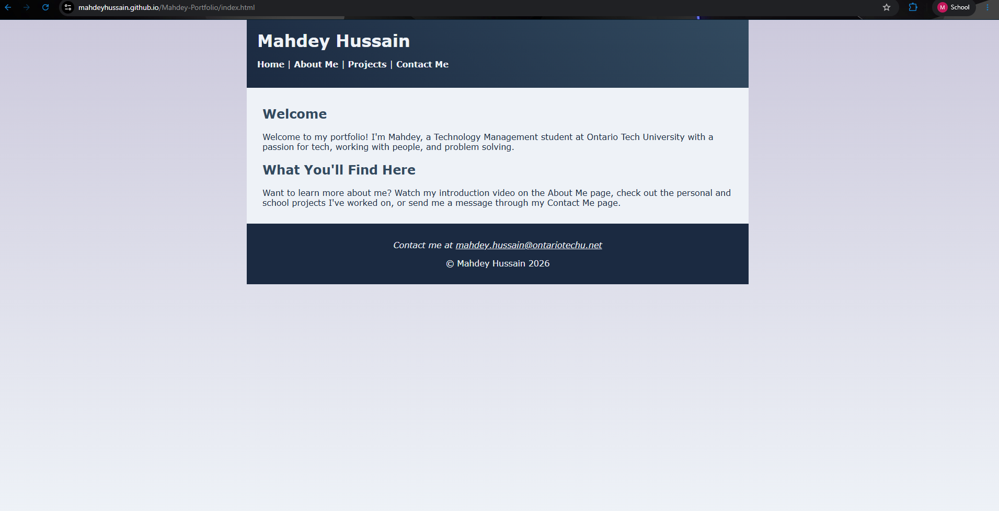

**Tablet - iPad (tablet.css):**

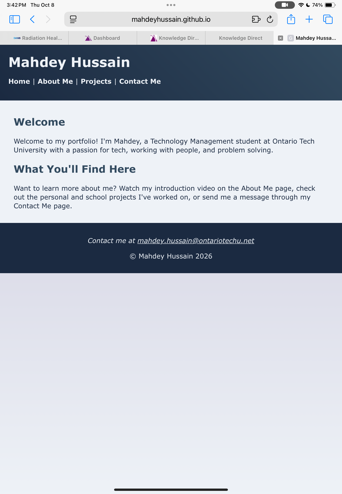

**Smartphone - iPhone (smartphone.css):**

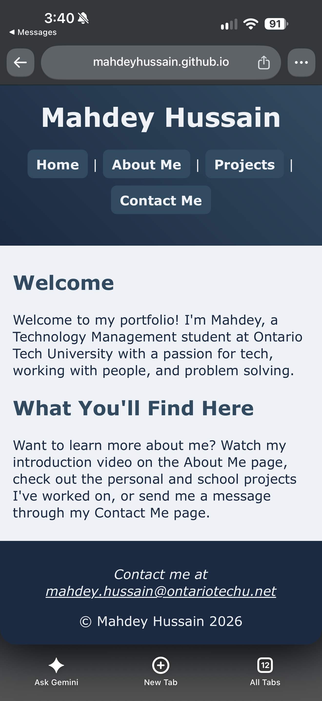

## Gradients

- **Linear gradient (top to bottom):** used on the `body` background in all three style sheets:
  `linear-gradient(to bottom, #CCC9DC 0%, #EEF2F7 100%)`
  It fades from grey-blue at the top to soft white at the bottom and shows on both sides of the content on laptops.
- **Angled linear gradient (45 degrees):** used on the `header` in all three style sheets:
  `linear-gradient(45deg, #1B2A41 0%, #324A5F 100%)`
  It blends navy into steel blue diagonally across the header.

Both gradients have a solid colour declared first as a fallback for browsers that can't display gradients (graceful degradation, Week 1).

## Colour Scheme

I created a five-colour scheme in **Adobe Color** (https://color.adobe.com/create) called "Portfolio Colours". It's a **complementary** scheme: navy and orange sit on opposite sides of the colour wheel, so the orange accents stand out against the blues. The colours are also listed in a comment at the top of each CSS file.

| Colour | Hex | Where it's used |
|---|---|---|
| Deep navy | `#1B2A41` | Header, footer, main text, photo frame |
| Steel blue | `#324A5F` | Project boxes, sub-headings, borders |
| Grey-blue | `#CCC9DC` | Page background gradient |
| Soft white | `#EEF2F7` | Content background, light text |
| Burnt orange | `#F46036` | Buttons, link hover, project title underlines |

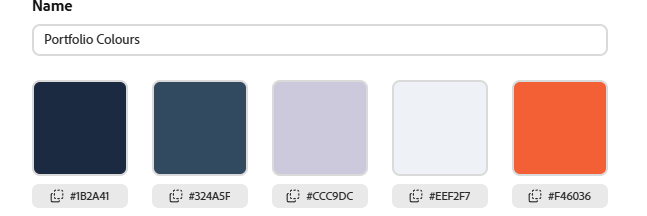

## Contact Form Validation

- **Name, email, phone, message, and robot check** all use `required`, so the form can't be submitted with empty fields.
- **Email** uses `type="email"`, so the browser checks for a valid email format.
- **Cell No.** uses `type="tel"` with `pattern="[0-9]{10}"`, so only a 10-digit number is accepted.
- **"What is 2 + 2?"** uses `type="number"` with `min="4"` and `max="4"`, so 4 is the only accepted answer.
- Every `<label>` is linked to its input with matching `for` and `id` attributes for accessibility.

## Testing and Validation

### HTML - W3C Markup Validation Service
All four pages passed with no errors or warnings.

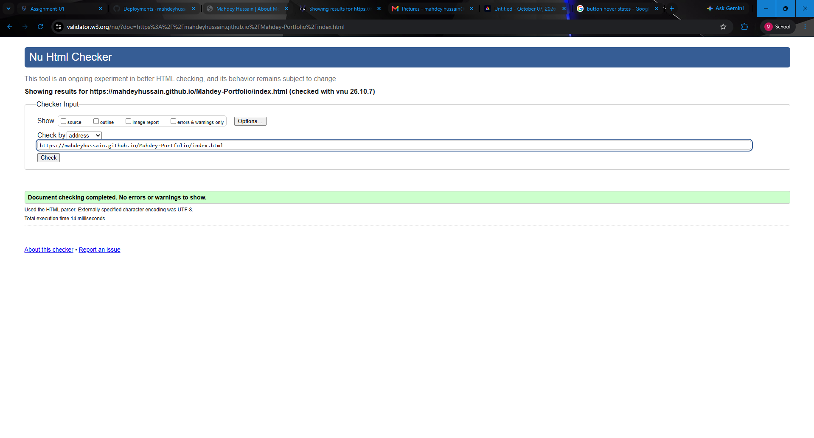
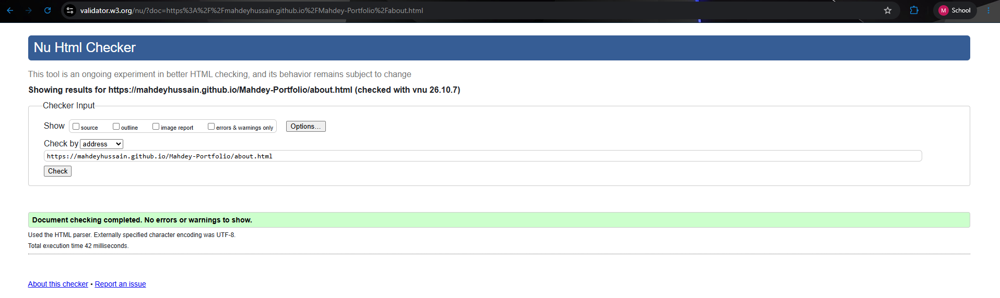
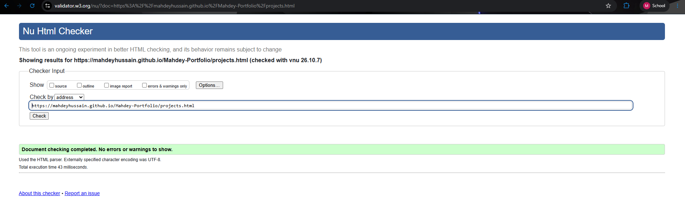
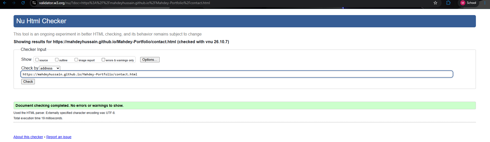

### CSS - W3C CSS Validation Service
All three style sheets passed with no errors.

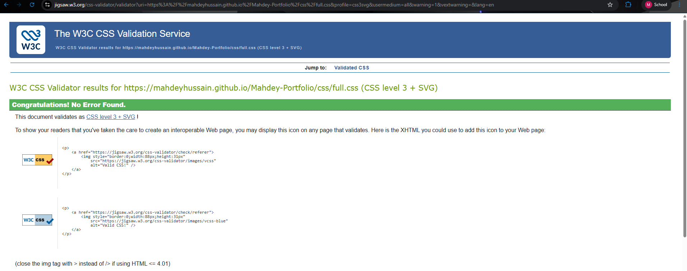
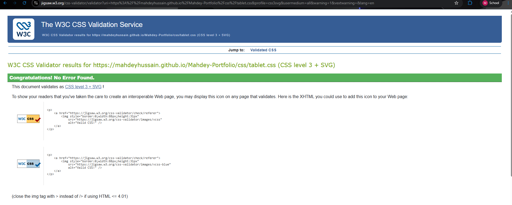
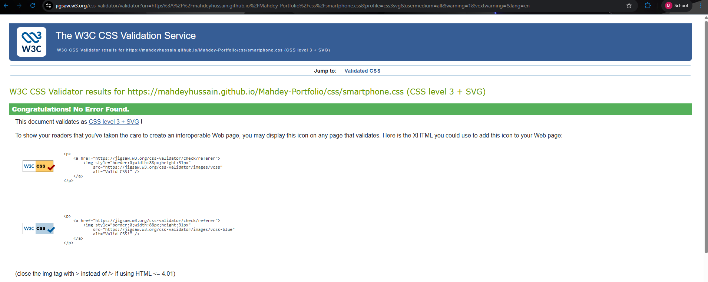

### Links - W3C Link Checker
All links work. The `mailto:` link is skipped by the link checker by design, since it can't test email links.

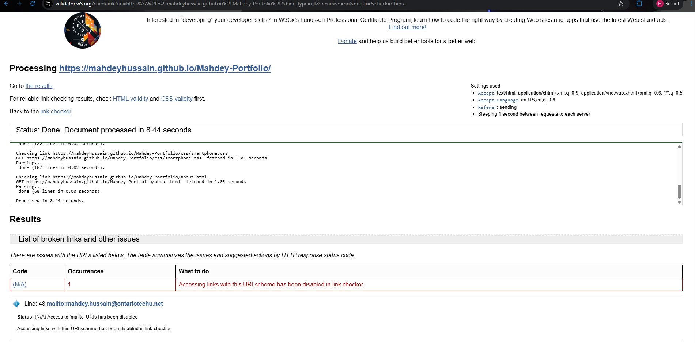

### Spelling
Checked with the Code Spell Checker extension in VS Code. Names such as Mahdey, PyScripter and TP-Link were added to the dictionary.

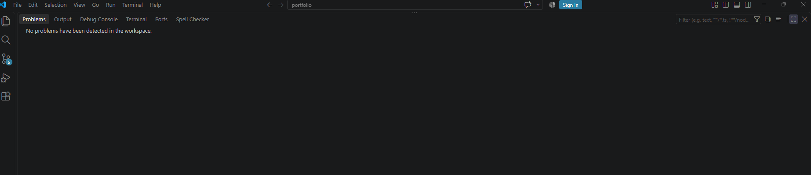

### Accessibility - WAVE
All four pages have 0 errors and 0 contrast errors. All images have `alt` text, the page language is set with `lang="en"`, and headings follow the correct order (h1, h2, h3).

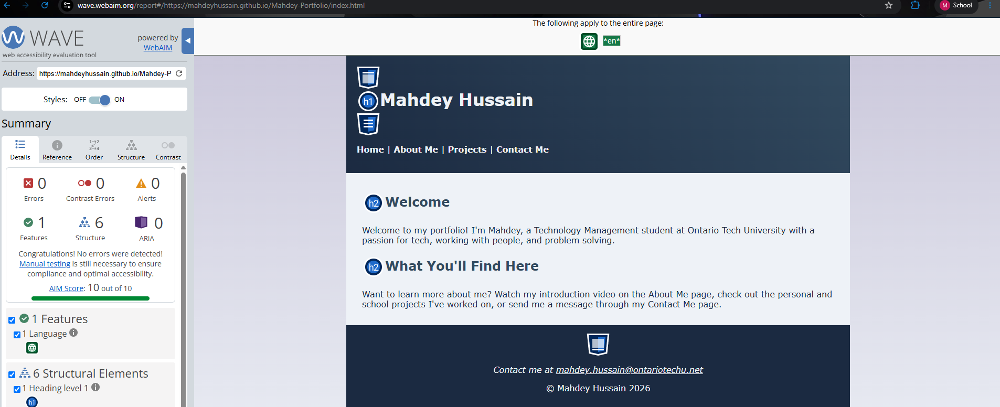
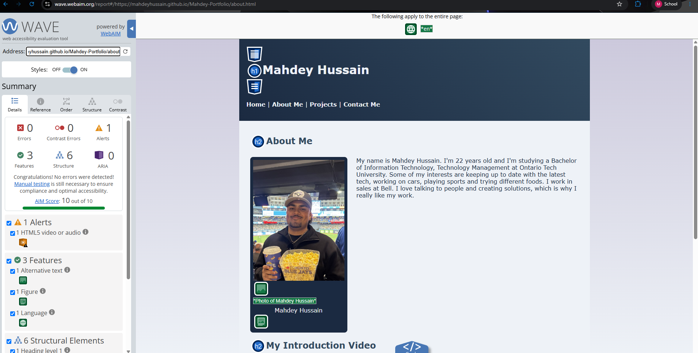
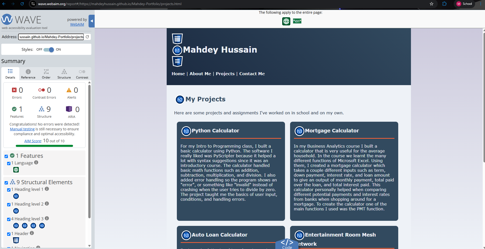
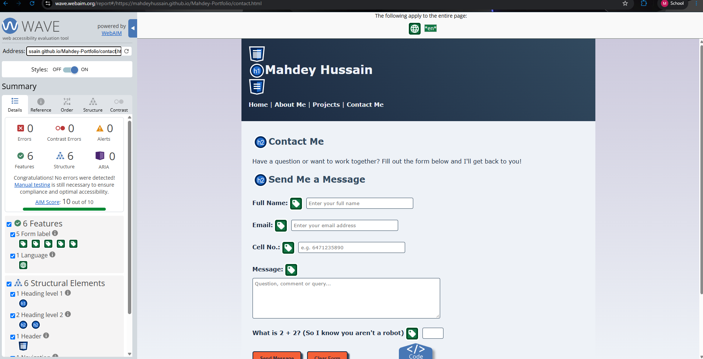

### Issues Found and Fixed During Testing
- The W3C validator warned that my `<article>` elements lacked a heading. I fixed it by moving each page's main heading directly inside the article, matching the semantic template from the Week 3 lecture.
- The CSS validator found a stray line of HTML inside `full.css` that caused a parse error. I removed it and re-validated.

## External Code and Credits

- **Phone number validation:** the `pattern="[0-9]{10}"` attribute on the phone field in `contact.html` is based on the W3Schools HTML input pattern reference: https://www.w3schools.com/tags/att_input_pattern.asp. It restricts the field to exactly 10 digits. This is one line, well under the 10% external code limit.
- **Colour scheme:** created with Adobe Color.
- All other code is my own, written using techniques from the INFR3120 lecture material (Weeks 1-4).
- The photo and introduction video are my own.